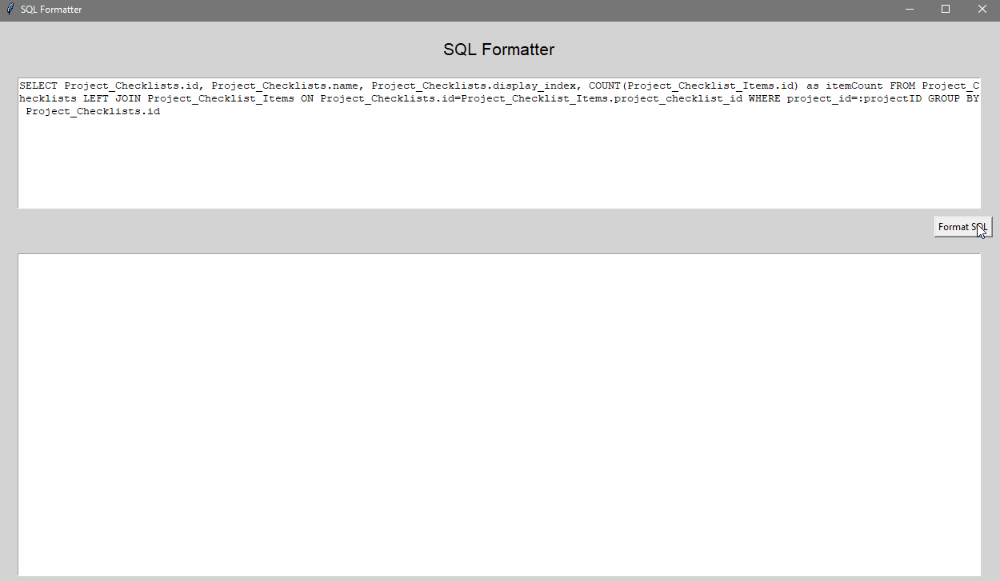

<!-- PROJECT LOGO -->
<br />
<p align="center">
  <a href="https://github.com/rrickgauer/sql-format">
    
  </a>

  <p align="center">
    Format your SQL statements
  </p>
</p>

## Table of Contents

1. [About the Project](#about-the-project)
1. [Installation](#installation)
1. [Usage](#usage)
1. [Example](#example)
1. [Roadmap](#roadmap)
1. [Contributing](#contributing)
1. [License](#license)
1. [Contact](#contact)


## About The Project



I've been using the [sql-pretty-printer API](https://github.com/sqlparser/sql-pretty-printer) for some time now, but I always had to modify the configuration options to my personal needs. So I decided to build a simple wrapper to call the api using python.

## Installation

To install, download the repository with pip via:

```sh
pip install --upgrade sql_format
```

## Usage

To use sql_format, just enter:

```sh
sql_format
```

Just paste your SQL code into the top text box and click the button, and the program putputs your formatted statement below. 

## Example

sql-format will take the following SQL statement:

```sql
select Songs.id, Songs.title, Artists.name from Songs left join Artists on Songs.artist_id = Artists.id where Songs.id > 100 order by Songs.title desc limit 20;
```

and turns it into this:

```sql
SELECT Songs.id,
       Songs.title,
       Artists.name
FROM   Songs
       LEFT JOIN Artists
              ON Songs.artist_id = Artists.id
WHERE  Songs.id > 100
ORDER  BY Songs.title DESC
LIMIT  20;
```


<!-- ROADMAP -->
## Roadmap

See the [open issues](https://github.com/rrickgauer/sql-format/issues) for a list of proposed features (and known issues).


<!-- CONTRIBUTING -->
## Contributing

Contributions are what make the open source community such an amazing place to be learn, inspire, and create. Any contributions you make are **greatly appreciated**.

1. Fork the Project
2. Create your Feature Branch (`git checkout -b feature/AmazingFeature`)
3. Commit your Changes (`git commit -m 'Add some AmazingFeature'`)
4. Push to the Branch (`git push origin feature/AmazingFeature`)
5. Open a Pull Request


<!-- LICENSE -->
## License

Distributed under the MIT License. See [LICENSE(LICENSE) for more information.


<!-- CONTACT -->
## Contact

[Ryan Rickgauer](https://www.ryanrickgauer.com/resume/index.html)
